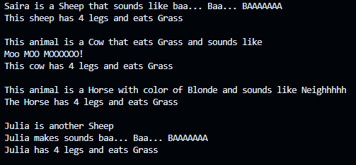
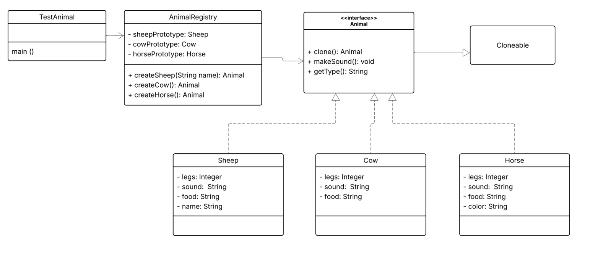

# Prototype Design Pattern

## Overview
The **Prototype Design Pattern** is a creational design pattern that creates new objects by cloning an existing object (prototype) instead of creating them from scratch. This repository demonstrates the prototype pattern with `Animal` objects (Sheep, Cow, Horse).

## How It Works in This Example

```
AnimalRegistry (manages prototypes)
    ↓
    Stores: Sheep, Cow, Horse prototypes (pre-initialized)
    ↓
createSheep() → calls sheepProto.clone()
createCow()   → calls cowProto.clone()
createHorse() → calls horseProto.clone()
```

Each concrete animal class implements a **copy constructor**

```java
public Sheep(Sheep sheep) {
    this.legs = sheep.legs;
    this.sound = sheep.sound;
    this.food = sheep.food;
    this.name = sheep.name;
}
```

## Sample Output

When you run the `Test.java` file:


Each animal is created by **cloning** the prototype instead of calling the full constructor.

## Pattern Components

- **Animal Interface**: Defines the `clone()` method contract
- **Concrete Classes** (Sheep, Cow, Horse): Implement `clone()` using copy constructor
- **AnimalRegistry**: Stores and manages prototypes, provides factory methods to clone them

